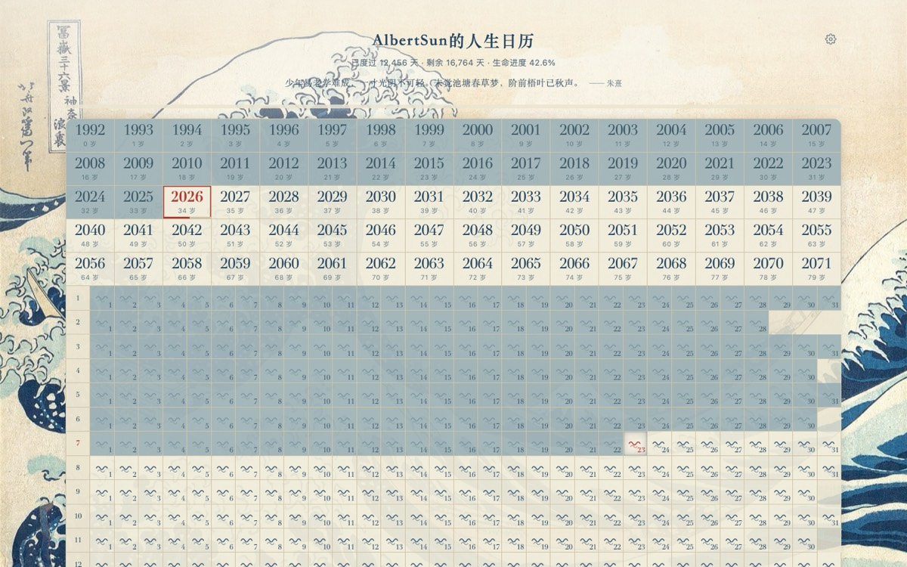

# 人生日历 Life Calendar

把一生画成一张表的浏览器扩展（Chrome / Edge，Manifest V3）：上半部分是 80 年的年格，下半部分是今年的逐日格。灰色的是已经走过的日子，空白的是还剩下的生命。



## 功能

- **人生日历**：5 行 × 16 列年格（出生年起 80 年）+ 当年 12 个月逐日格；年格宽 = 2×日格宽，上下严格等宽；过去灰、未来白、当年/当月/当天红字；灰色每天自动推进
- **年份切换**：点击任意年格，下方月日网格切换展示该年（过去年全灰、未来年全白，闰年 2 月自动 29 格）
- **年格信息**：年龄小字（可关）、今年格年度进度条、点击切换视图
- **人生进度条**：80 段对应 80 个年格，今年那段按天部分填充
- **五套预制主题**（背景为公有领域名画，配色取自画中）：
  | 主题 | 画作 |
  | --- | --- |
  | 默认 | 白纸灰格（无图） |
  | 死亡日记 | 梵高《星月夜》 |
  | 深水潜流 | 葛饰北斋《神奈川冲浪里》 |
  | 希望田野 | 梵高《麦田与柏树》 |
  | 青春之歌 | 莫奈《撑阳伞的女人》 |
- **自定义主题**：预制主题只读，可另存为副本后自由修改——配色、格子图形（灯泡/浪花/禾苗/音符）、上传背景图、顶部遮罩、不透明度
- **毛玻璃滑杆**：全主题生效，从实底到全透明磨砂（macOS 风格 backdrop-filter）
- **里程碑标记**：生日/纪念日/目标日，蛋糕/戒指/旗帜/星星/爱心图标，支持每年重复或一次性日期
- **每日一句 + 历史上的今天**：本地预置，离线可用，可独立开关
- **多语言**：简中 / 繁中 / 日 / 韩 / 英，默认跟随系统
- **跨天自动刷新**：定时 + 切回标签页双重检测；时区可指定，跨时区旅行不错乱

## 安装

1. `chrome://extensions`（Edge 为 `edge://extensions`）→ 开启「开发者模式」
2. 「加载已解压的扩展程序」→ 选择本目录
3. 打开新标签页，首次使用选择出生日期即可

## 技术

- 零依赖零构建：原生 HTML/CSS/JS（ES Modules），Manifest V3
- 主题系统数据驱动：`lib/theme-presets.js`（数据）→ `lib/theme-css.js`（生成 CSS）→ 动态注入
- 存储分层：配置走 `chrome.storage.sync`（随账号同步）；自定义背景图压缩后存 `chrome.storage.local`（仅本机，sync 的 8KB 单项限额放不下图片）
- 无后端、无网络请求、无跟踪

## 画作版权

四个主题背景均为公有领域（Public Domain）作品，经 Wikimedia Commons 获取并已压缩打包至 `assets/`。

## 目录结构

```
├── manifest.json          # MV3 清单（新标签页覆盖 + 设置页）
├── newtab.html/css/js     # 主界面
├── options.html/css/js    # 设置页（复用设置面板组件）
├── settings-panel.js/css  # 设置面板组件（弹窗与设置页共用）
├── theme-editor.js        # 主题编辑器
├── lib/                   # 常量/日期/存储/主题/图形/图标/i18n/名言/历史
├── themes → 已废弃        # 主题已数据驱动，见 lib/theme-presets.js
├── assets/                # 四幅公有领域画作（已压缩）
├── icons/                 # 扩展图标
└── tools/                 # 取色脚本（xcrun swift tools/extract-colors.swift）
```
